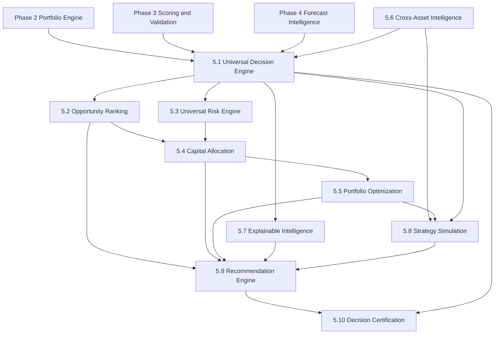
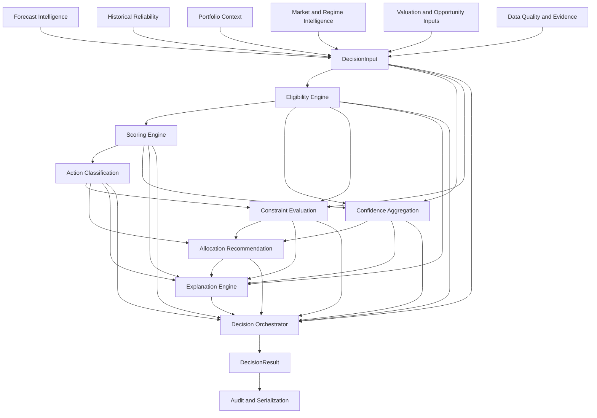
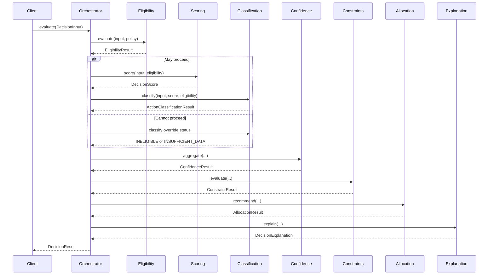
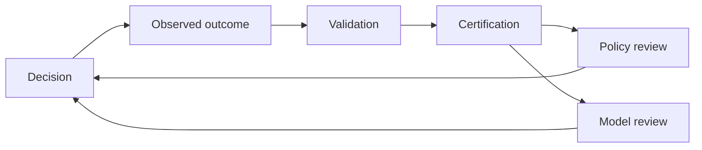

# Phase 5 — Universal Decision Intelligence Architecture

**Architecture version:** 1.0  
**Platform phase:** Phase 5  
**Current implementation:** Phase 5.1.4 complete  
**Primary package:** `foundation.intelligence.decision`

---

## 1. Purpose

Phase 5 transforms the Universal Investment Platform from an analytical
and forecasting system into a governed decision-intelligence platform.

Earlier phases answer:

- What assets and positions exist?
- How is the portfolio allocated?
- How have assets performed?
- What outcomes are forecast?
- How reliable are those forecasts?

Phase 5 answers:

- Is an opportunity suitable for consideration?
- How attractive is it relative to alternatives?
- What action should be taken?
- How confident is the platform?
- How much capital may be deployed?
- What constraints affected the recommendation?
- Why was the decision produced?
- How did the decision perform afterward?

Phase 5 does not directly execute trades or purchases. It produces
auditable, policy-governed recommendations that may be reviewed,
approved, simulated, exported, and later certified.

---

## 2. Architectural principles

### 2.1 Asset-class neutrality

The decision engine operates on standardized intelligence rather than
asset-specific schemas.

The same decision framework must support:

- equities;
- ETFs;
- cryptocurrency;
- metals;
- collectibles;
- real estate;
- cash and cash equivalents;
- future registered asset classes.

Asset-specific interpretation remains inside adapters and source
platforms.

### 2.2 Explainability

Every recommendation must retain:

- its input intelligence;
- eligibility checks;
- weighted scoring components;
- penalties;
- action thresholds;
- confidence components;
- constraint results;
- allocation limits;
- supporting evidence;
- policy and model versions.

### 2.3 Determinism by default

Given identical inputs, policies, profiles, and timestamps, the engine
should produce identical results.

Probabilistic or learned components may be added later, but their output
must be converted into explicit, versioned decision inputs.

### 2.4 Policy governance

Thresholds, weights, concentration limits, and decision rules belong in
validated policy or profile objects.

They should not be scattered as unexplained constants throughout the
implementation.

### 2.5 Separation of concerns

The engine separates:

- investability;
- attractiveness;
- action;
- certainty;
- portfolio permission;
- allocation;
- explanation;
- orchestration;
- persistence;
- certification.

A high score does not automatically imply that capital may be deployed.

### 2.6 Fail-safe behavior

Missing, stale, conflicting, or invalid information should result in:

- conditional eligibility;
- insufficient data;
- ineligibility;
- reduced confidence;
- reduced allocation;
- or no recommendation.

The system must not manufacture certainty.

### 2.7 Historical testability

Every meaningful policy, scoring profile, confidence profile, and
allocation profile must be versioned so that historical decisions can be
reconstructed.

---

## 3. Phase 5 capability map

| Component | Capability | Primary output |
|---|---|---|
| 5.1 | Universal Decision Engine | `DecisionResult` |
| 5.2 | Opportunity Ranking | Ranked decisions |
| 5.3 | Universal Risk Engine | Portfolio risk budget |
| 5.4 | Capital Allocation Engine | Capital deployment plan |
| 5.5 | Portfolio Optimization | Target portfolio |
| 5.6 | Cross-Asset Intelligence | Propagated cross-asset signals |
| 5.7 | Explainable Intelligence | Decision narratives and evidence |
| 5.8 | Strategy Simulation | Scenario outcomes |
| 5.9 | Recommendation Engine | Daily and monthly recommendations |
| 5.10 | Decision Certification | Historical decision performance |

Phase 5.1 creates the decision object consumed by all later Phase 5
components.

---

## 4. Phase 5 dependency architecture



---

## 5. Universal decision data flow



---

## 6. Phase 5.1 package architecture

The target package structure is:

```text
foundation/
└── intelligence/
    └── decision/
        ├── contracts/
        ├── eligibility/
        ├── scoring/
        ├── classification/
        ├── confidence/
        ├── constraints/
        ├── allocation/
        ├── explanation/
        ├── orchestration/
        ├── serialization/
        └── certification/
```

### Implemented packages

```text
contracts/
eligibility/
scoring/
classification/
```

### Planned packages

```text
confidence/
constraints/
allocation/
explanation/
orchestration/
serialization/
certification/
```

---

## 7. Phase 5.1 implementation sequence

| Subphase | Component | Status |
|---|---|---|
| 5.1.1 | Decision contracts and domain models | Complete |
| 5.1.2 | Eligibility and data-quality engine | Complete |
| 5.1.3 | Universal decision scoring engine | Complete |
| 5.1.4 | Universal action classification engine | Complete |
| 5.1.5 | Confidence aggregation engine | Planned |
| 5.1.6 | Constraint and allocation engine | Planned |
| 5.1.7 | Decision explanation engine | Planned |
| 5.1.8 | Decision orchestrator | Planned |
| 5.1.9 | Serialization and audit outputs | Planned |
| 5.1.10 | Decision-engine certification | Planned |

---

## 8. Core decision contracts

### 8.1 DecisionInput

`DecisionInput` represents normalized intelligence for one asset,
portfolio, and time horizon.

Current inputs include:

- asset identity;
- asset class;
- time horizon;
- portfolio context;
- forecast strength;
- forecast confidence;
- historical reliability;
- risk-adjusted opportunity;
- market-regime alignment;
- diversification fit;
- liquidity quality;
- valuation attractiveness;
- data quality;
- supporting evidence;
- metadata.

Decision inputs use normalized zero-to-one-hundred component scores.

### 8.2 EligibilityResult

`EligibilityResult` records whether the opportunity may proceed.

Possible statuses:

- `ELIGIBLE`;
- `CONDITIONALLY_ELIGIBLE`;
- `INSUFFICIENT_DATA`;
- `INELIGIBLE`.

It retains every passed and failed rule.

### 8.3 DecisionScore

`DecisionScore` separates:

- weighted base score;
- explicit penalties;
- final score;
- scoring version.

Component scores and penalties remain visible for audit purposes.

### 8.4 ActionClassificationResult

`ActionClassificationResult` converts eligibility, score, and ownership
context into a universal action.

Possible actions:

- `STRONG_BUY`;
- `BUY`;
- `ACCUMULATE`;
- `HOLD`;
- `WAIT`;
- `REDUCE`;
- `SELL`;
- `AVOID`;
- `INELIGIBLE`;
- `INSUFFICIENT_DATA`.

### 8.5 DecisionResult

`DecisionResult` is the final Phase 5.1 output.

It will ultimately contain:

- decision identifier;
- asset identity;
- asset class;
- action;
- lifecycle status;
- eligibility;
- score;
- confidence;
- maximum allocation;
- reasons;
- evidence;
- policy violations;
- policy version;
- generation time;
- expiration time;
- metadata.

---

## 9. Phase 5.1.5 — Confidence aggregation design

Confidence measures certainty in the recommendation.

It is separate from the opportunity score.

An asset may have:

- a high opportunity score with moderate confidence;
- a moderate score with high confidence;
- a low score with high confidence;
- or no actionable confidence because evidence is inadequate.

### 9.1 Proposed confidence inputs

| Component | Default weight |
|---|---:|
| Forecast confidence | 25% |
| Historical reliability | 25% |
| Data quality | 20% |
| Evidence quality | 15% |
| Evidence consistency | 10% |
| Eligibility quality | 5% |

### 9.2 Proposed confidence adjustments

Confidence may be reduced by:

- conditional eligibility;
- stale evidence;
- conflicting evidence;
- limited evidence quantity;
- forecast-model disagreement;
- unsupported asset-specific assumptions;
- unstable market regime;
- weak historical calibration.

### 9.3 Proposed output

```text
ConfidenceResult
├── raw_confidence
├── adjustment_score
├── final_confidence
├── component_scores
├── adjustments
├── confidence_band
├── reasons
└── confidence_version
```

### 9.4 Confidence bands

| Confidence | Band |
|---|---|
| 0.85–1.00 | Very high |
| 0.70–0.8499 | High |
| 0.55–0.6999 | Moderate |
| 0.40–0.5499 | Low |
| 0.00–0.3999 | Very low |

Confidence bands are descriptive and should not independently determine
the action.

---

## 10. Phase 5.1.6 — Constraint and allocation design

This stage determines whether an otherwise valid recommendation can
receive capital and the maximum amount that may be deployed.

### 10.1 Constraint categories

#### Hard constraints

A hard failure prevents additional allocation.

Examples:

- asset maximum reached;
- asset-class maximum reached;
- no deployable capital;
- policy prohibition;
- insufficient liquidity;
- prohibited account or vehicle;
- minimum transaction requirement cannot be met.

#### Soft constraints

A soft constraint reduces the proposed allocation.

Examples:

- concentration approaching the maximum;
- conditional eligibility;
- moderate confidence;
- elevated volatility;
- correlated exposure;
- weak liquidity;
- unfavorable tax consequences;
- near-term cash-flow need.

### 10.2 Allocation boundaries

The allocation engine should calculate:

```text
available-capital limit
asset-weight capacity
asset-class capacity
target-allocation gap
confidence-adjusted limit
liquidity-adjusted limit
risk-budget limit
policy maximum
```

The maximum permitted allocation is the minimum of all applicable
limits.

### 10.3 Proposed allocation output

```text
AllocationResult
├── requested_allocation
├── maximum_allocation
├── recommended_allocation
├── binding_constraint
├── constraint_results
├── allocation_percentage
├── allocation_basis
├── reasons
└── allocation_version
```

### 10.4 Separation from Phase 5.4

Phase 5.1.6 calculates a safe allocation boundary for one decision.

Phase 5.4 allocates capital across multiple competing opportunities.

---

## 11. Phase 5.1.7 — Explanation engine design

The explanation engine converts structured decision artifacts into
auditable human-readable explanations.

It must not invent reasoning that is absent from the structured results.

### 11.1 Explanation layers

#### Executive explanation

A concise recommendation summary.

Example:

```text
BUY with high confidence. The asset has strong forecast support,
acceptable historical reliability, and sufficient portfolio capacity.
```

#### Analytical explanation

A component-level explanation covering:

- strongest positive contributors;
- weakest contributors;
- penalties;
- eligibility conditions;
- confidence adjustments;
- portfolio constraints;
- allocation limits.

#### Audit explanation

A machine-oriented evidence trail including identifiers, versions,
timestamps, rule outcomes, and input values.

### 11.2 Proposed output

```text
DecisionExplanation
├── headline
├── executive_summary
├── positive_factors
├── negative_factors
├── warnings
├── eligibility_explanation
├── scoring_explanation
├── confidence_explanation
├── allocation_explanation
├── evidence_references
└── explanation_version
```

---

## 12. Phase 5.1.8 — Decision orchestrator design

The orchestrator is the public application-service layer for Phase 5.1.

It coordinates components but does not duplicate their logic.

### 12.1 Orchestration sequence



### 12.2 Orchestrator responsibilities

The orchestrator should:

- validate coherent policy versions;
- invoke components in the correct order;
- short-circuit safely;
- preserve intermediate artifacts;
- generate a decision identifier;
- assign timestamps and expiration;
- construct `DecisionResult`;
- emit audit metadata.

The orchestrator should not:

- calculate scoring weights directly;
- reproduce eligibility rules;
- override classification thresholds;
- create unstructured explanations;
- silently suppress failures.

---

## 13. Phase 5.1.9 — Serialization and audit design

Decision artifacts must support stable serialization for:

- JSON exports;
- CSV summaries;
- database persistence;
- dashboard ingestion;
- API responses;
- historical certification.

### 13.1 Serialization requirements

Serialized records must preserve:

- enums as stable string values;
- decimals without binary rounding loss;
- timezone-aware timestamps;
- policy and model versions;
- nested evidence;
- component scores;
- penalties;
- constraints;
- explanation fields.

### 13.2 Proposed serializers

```text
DecisionJSONSerializer
DecisionSummarySerializer
DecisionAuditSerializer
DecisionCSVExporter
```

### 13.3 Output levels

#### Summary output

One row per decision for rankings and dashboards.

#### Detail output

Full structured decision record.

#### Audit output

Immutable reconstruction package containing all relevant inputs,
intermediate results, and versions.

### 13.4 Schema versioning

Serialization schema versions should be independent from engine
component versions.

Example:

```text
decision_schema_version = "1.0"
scoring_version = "5.1.3"
classification_version = "5.1.4"
policy_version = "5.1.2"
```

---

## 14. Phase 5.1.10 — Certification design

Certification verifies that the complete decision engine is reliable,
reproducible, and safe for downstream use.

### 14.1 Functional certification

Validate:

- contract enforcement;
- eligibility precedence;
- weighted scoring;
- penalty calculations;
- action boundaries;
- confidence calculations;
- constraint behavior;
- allocation limits;
- explanation completeness;
- serialization round trips;
- orchestration short-circuit behavior.

### 14.2 Cross-asset certification

Test representative decisions for:

- cryptocurrency;
- ETFs;
- metals;
- collectibles;
- real estate;
- cash equivalents.

### 14.3 Boundary certification

Test exact values around:

- score thresholds;
- eligibility minimums;
- confidence bands;
- concentration limits;
- zero capital;
- zero position;
- maximum allocation;
- evidence freshness cutoffs.

### 14.4 Historical certification

Replay historical periods and compare:

- decision action;
- decision score;
- confidence;
- subsequent return;
- drawdown;
- action accuracy;
- calibration;
- opportunity cost.

### 14.5 Reproducibility certification

The same audit input package must reproduce the same:

- eligibility result;
- score;
- action;
- confidence;
- constraints;
- allocation;
- explanation;
- final decision.

### 14.6 Certification output

```text
DecisionEngineCertification
├── certification_id
├── engine_version
├── test_timestamp
├── test_counts
├── cross_asset_results
├── boundary_results
├── reproducibility_results
├── historical_results
├── warnings
├── failures
└── certification_status
```

---

## 15. Opportunity ranking architecture

Phase 5.2 consumes completed decision results.

Ranking must not rely on final score alone.

Proposed ranking inputs:

- decision score;
- confidence;
- action;
- risk-adjusted opportunity;
- maximum allocation;
- liquidity;
- diversification contribution;
- time horizon;
- decision freshness;
- eligibility conditions.

A high-scoring but low-confidence opportunity should not necessarily rank
above a slightly lower-scoring, high-confidence opportunity.

---

## 16. Universal risk architecture

Phase 5.3 evaluates portfolio-level risk not visible in isolated asset
decisions.

Risk categories include:

- volatility;
- drawdown;
- tail risk;
- liquidity;
- concentration;
- correlation;
- factor exposure;
- duration;
- credit;
- inflation sensitivity;
- currency exposure;
- macro-regime sensitivity;
- political and regulatory risk;
- collectible-market execution risk.

The risk engine supplies risk budgets to Phase 5.4 and Phase 5.5.

---

## 17. Capital allocation architecture

Phase 5.4 distributes a capital budget across ranked opportunities.

It consumes:

- ranked decisions;
- single-decision allocation limits;
- portfolio risk budget;
- target allocations;
- current allocations;
- available monthly capital;
- liquidity requirements;
- minimum transaction sizes;
- personal financial constraints.

It produces a capital deployment plan rather than isolated
recommendations.

---

## 18. Portfolio optimization architecture

Phase 5.5 determines a target portfolio.

Optimization inputs may include:

- expected return;
- forecast confidence;
- forecast distribution;
- downside risk;
- correlation;
- liquidity;
- taxes;
- turnover;
- transaction costs;
- asset-class boundaries;
- personal objectives;
- time horizon;
- market regime.

Traditional mean-variance optimization may be one candidate model, but
it is not the sole decision framework.

---

## 19. Cross-asset intelligence architecture

Phase 5.6 propagates signals between asset classes.

Examples:

```text
Interest rates
→ housing affordability
→ construction activity
→ copper demand
→ metals outlook
→ equity-sector opportunity
```

```text
Dollar strength
→ commodity pricing
→ gold and silver
→ emerging-market equities
→ cryptocurrency liquidity
```

Cross-asset intelligence should create structured signals that enter
`DecisionInput`, not directly override final actions.

---

## 20. Strategy simulation architecture

Phase 5.8 evaluates decisions and portfolios under scenarios.

Scenario categories include:

- recession;
- inflation resurgence;
- rate cuts;
- rate increases;
- equity drawdown;
- cryptocurrency drawdown;
- commodity shock;
- housing decline;
- dollar appreciation;
- dollar depreciation;
- liquidity shock.

Simulation results may inform risk, confidence, allocation, and
optimization but must remain separate from observed historical results.

---

## 21. Recommendation architecture

Phase 5.9 assembles user-facing recommendations.

Potential outputs include:

### Daily opportunity report

```text
Rank
Asset
Action
Score
Confidence
Maximum allocation
Primary reason
Primary risk
```

### Monthly allocation plan

```text
Available capital
Asset-class allocations
Asset allocations
Cash reserve
Deferred opportunities
Constraint explanations
```

### Portfolio action report

```text
Buy
Accumulate
Hold
Reduce
Sell
Wait
Avoid
```

---

## 22. Decision certification and learning loop



The system should learn through governed version updates rather than
silently modifying prior decisions.

---

## 23. Integration points

### 23.1 Forecast engine

Required forecast integrations:

- forecast direction;
- expected return;
- forecast confidence;
- prediction interval;
- downside distribution;
- model agreement;
- forecast freshness;
- historical forecast accuracy.

### 23.2 Portfolio engine

Required portfolio integrations:

- portfolio value;
- available capital;
- current position;
- asset weight;
- asset-class weight;
- target weights;
- contribution budget;
- rebalancing gap;
- realized and unrealized performance.

### 23.3 Historical validation

Required validation integrations:

- forecast calibration;
- directional accuracy;
- error metrics;
- regime performance;
- sample size;
- decision outcome history.

### 23.4 Asset registry

Required registry integrations:

- canonical asset identifier;
- asset class;
- liquidity classification;
- tradability;
- supported vehicle;
- minimum purchase amount;
- valuation source;
- platform source.

---

## 24. Testing strategy

### 24.1 Unit tests

Each component must independently test:

- successful behavior;
- invalid contracts;
- exact thresholds;
- configuration validation;
- failure precedence;
- empty and extreme inputs.

### 24.2 Integration tests

Integration suites should test:

```text
DecisionInput
→ EligibilityResult
→ DecisionScore
→ ActionClassificationResult
→ ConfidenceResult
→ ConstraintResult
→ AllocationResult
→ DecisionExplanation
→ DecisionResult
```

### 24.3 Cross-asset fixtures

Fixtures should include representative assets such as:

```text
CRYPTO:BTC
ETF:VOO
ETF:SCHD
METAL:GOLD
METAL:COPPER
MTG:FINAL_FANTASY_COLLECTOR_BOX
HOUSING:WICHITA_METRO
CASH:USD
```

### 24.4 Regression tests

Every Phase 5 subphase must run:

- its focused tests;
- all decision-engine tests;
- the complete repository test suite.

### 24.5 Serialization tests

Serialization tests must verify:

- round-trip equality;
- decimal precision;
- timestamp preservation;
- stable enum values;
- schema-version compatibility.

---

## 25. Versioning strategy

| Version | Purpose |
|---|---|
| Policy version | Eligibility and action rules |
| Scoring version | Weights and penalties |
| Classification version | Score-to-action mapping |
| Confidence version | Confidence calculation |
| Allocation version | Allocation methodology |
| Explanation version | Explanation format |
| Schema version | Serialized representation |
| Engine version | Orchestrated system release |

A decision record should retain every version required for historical
reconstruction.

---

## 26. Error-handling strategy

Errors should be grouped into:

### Contract errors

Invalid data structures or values.

### Configuration errors

Invalid policies, weights, thresholds, or profiles.

### Evaluation outcomes

Expected nonexception states such as:

- ineligible;
- insufficient data;
- conditional eligibility;
- zero allocation.

### Orchestration errors

Inconsistent intermediate artifacts, mismatched asset identifiers, or
incompatible component versions.

Expected negative investment outcomes should generally be represented as
structured results rather than Python exceptions.

---

## 27. Security and operational boundaries

The Decision Engine:

- does not store brokerage credentials;
- does not execute trades;
- does not bypass platform authorization;
- does not guarantee investment outcomes;
- does not conceal missing data;
- does not overwrite historical decisions;
- does not mutate a certified decision in place.

Execution capability, if ever added, must be a separate governed layer.

---

## 28. Phase 5.1 completion definition

Phase 5.1 is complete when the platform can:

1. Accept a valid universal decision input.
2. Evaluate eligibility and data quality.
3. Calculate a transparent weighted score.
4. Classify an action.
5. Calculate recommendation confidence.
6. Evaluate portfolio and policy constraints.
7. Calculate a maximum permitted allocation.
8. Produce structured explanations.
9. Construct a complete `DecisionResult`.
10. Serialize and reconstruct the decision.
11. Pass focused, integration, cross-asset, and repository tests.
12. Produce a Phase 5.1 certification report.

---

## 29. Immediate implementation roadmap

```text
5.1.5  Universal Confidence Aggregation Engine
5.1.6  Constraint and Allocation Engine
5.1.7  Decision Explanation Engine
5.1.8  Universal Decision Orchestrator
5.1.9  Serialization and Audit Outputs
5.1.10 Decision Engine Certification
```

Interfaces should follow the architecture defined in this document unless
a later architecture decision record explicitly supersedes it.

---

## 30. Architecture decision log

| ID | Decision | Status |
|---|---|---|
| ADR-5-001 | Keep opportunity score separate from confidence | Accepted |
| ADR-5-002 | Separate single-decision allocation from portfolio-wide allocation | Accepted |
| ADR-5-003 | Treat eligibility failures as structured outcomes | Accepted |
| ADR-5-004 | Preserve explicit scoring penalties | Accepted |
| ADR-5-005 | Make classification ownership-sensitive | Accepted |
| ADR-5-006 | Cap positive conditional actions at ACCUMULATE | Accepted |
| ADR-5-007 | Keep trade execution outside Phase 5 | Accepted |
| ADR-5-008 | Version all historically relevant decision components | Accepted |
